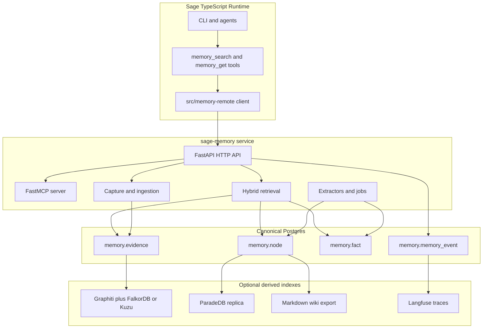

# Sage Memory Implementation Plan

This plan converts the May 2026 memory research into an implementation spec for this repository. It is intentionally narrower than the research memo: it keeps the useful architecture, removes assumptions that do not survive validation, and defines the concrete build path.

The governing rule is:

> Immutable evidence is canonical. Every summary, fact, graph edge, wiki page, skill, index row, and retrieval trace is derived, audited, and rebuildable.

## Verdict

Sage is not ready to implement the full six-layer memory system directly from the research memo. It is ready to implement Phase 0 and Phase 1 from this spec.

The missing pieces were:

- A Supabase-compatible extension strategy.
- A repository layout that fits this TypeScript repo while allowing a Python memory service.
- A concrete SQL schema that avoids mixing embedding dimensions.
- A migration path from the current Markdown and sqlite-vec memory system.
- API, MCP, and TypeScript integration contracts.
- Retrieval scoring and token-budget behavior precise enough to test.
- A first-build sequence with acceptance checks.

## Validation status

| Research claim                                            | Status                    | Implementation response                                                                                                                                                                                                                                                                                                                      |
| --------------------------------------------------------- | ------------------------- | -------------------------------------------------------------------------------------------------------------------------------------------------------------------------------------------------------------------------------------------------------------------------------------------------------------------------------------------- |
| Use Postgres as canonical store                           | Valid                     | Build `memory.*` tables in the existing Supabase project or a local Postgres with matching migrations.                                                                                                                                                                                                                                       |
| Use pgvector, halfvec, and HNSW                           | Valid with version check  | pgvector supports vector, halfvec, sparsevec, and HNSW. Supabase documents pgvector as the `vector` extension. The migration must detect the installed extension version and fall back from `halfvec` to `vector` if needed. Sources: https://github.com/pgvector/pgvector and https://supabase.com/docs/guides/database/extensions/pgvector |
| Install ParadeDB `pg_search` in Supabase                  | Not safe                  | ParadeDB can run as a Postgres extension in self-managed Postgres, and its own docs recommend a logical replica pattern for managed providers. MVP uses Postgres FTS with `tsvector` and GIN. ParadeDB is an optional read-side replica later. Source: https://docs.paradedb.com/                                                            |
| Install Apache AGE in Supabase                            | Not assumed               | Do not require AGE for MVP. Use relational graph tables (`memory.entity`, `memory.fact`, `memory.node_link`) in canonical Postgres.                                                                                                                                                                                                          |
| Install pgvectorscale in Supabase                         | Not assumed               | Treat DiskANN or pgvectorscale as a later self-managed or validated Supabase-project optimization, not an MVP dependency.                                                                                                                                                                                                                    |
| Use mem0 OSS                                              | Valid as optional adapter | mem0 is Apache 2.0 and describes itself as a universal memory layer. Use it as an extraction/reconciliation adapter only. Do not adopt mem0 as the system of record. Source: https://github.com/mem0ai/mem0                                                                                                                                  |
| Use Graphiti sidecar                                      | Valid as derived index    | Graphiti supports Neo4j, FalkorDB, Kuzu, and Neptune, plus MCP and FastAPI surfaces. Use it as a derived temporal graph sidecar after canonical facts work. Source: https://github.com/getzep/graphiti                                                                                                                                       |
| Use LangGraph PostgresSaver and Store                     | Valid but optional        | Build the memory service so LangGraph can use it, but do not make LangGraph the only client. Current Sage is TypeScript.                                                                                                                                                                                                                     |
| Use langgraph-bigtool for many skills                     | Valid later               | It is useful once skill count is high. MVP implements skill search in the memory API and can add bigtool when Sage has enough executable skills. Source: https://github.com/langchain-ai/langgraph-bigtool                                                                                                                                   |
| Use FastMCP and Streamable HTTP                           | Valid                     | MCP 2025-11-25 supports the gateway model. Bind local development to localhost and add auth before any non-local exposure. Source: https://modelcontextprotocol.io/specification/2025-11-25                                                                                                                                                  |
| Use Gemma 4 as the local default                          | Unverified                | Do not hard-code Gemma 4. Define a model profile interface and benchmark actual local models. Ollama/OpenAI-compatible providers are implementation details.                                                                                                                                                                                 |
| Use Wispr Flow, Granola, Cursor, and Claude exports in v1 | Partly product-specific   | Capture API supports these sources, but integrations are optional adapters. The MVP must not depend on paid or proprietary capture products.                                                                                                                                                                                                 |
| Use Langfuse and Inspect AI for evals                     | Valid as tooling          | Langfuse self-hosting and Inspect AI are viable. Add event schema now; deploy these tools when running retrieval experiments. Sources: https://langfuse.com/self-hosting and https://github.com/UKGovernmentBEIS/inspect_ai                                                                                                                  |

## Current repo baseline

The repository already has a memory system:

- `docs/concepts/memory.md` describes Markdown files as the current source of truth.
- `docs/experiments/research/memory.md` proposes offline Markdown plus derived indexes.
- `src/config/types.memory.ts` supports `builtin` and `qmd` memory backends.
- `src/memory/memory-schema.ts` defines the current local SQLite and sqlite-vec schema.
- `src/agents/tools/memory-tool.ts` exposes `memory_search` and `memory_get`.
- `extensions/memory-core` and `extensions/memory-lancedb` provide plugin surfaces.

The new system must be additive at first. It must not delete or rewrite the current memory path. The migration is:

1. Keep current Markdown memory as `builtin` or `qmd`.
2. Add a new remote backend value, tentatively `sage-memory`.
3. Bridge existing `memory_search` and `memory_get` tools to the memory service when that backend is selected.
4. Export current Markdown memories into `memory.evidence` and `memory.node` as a one-time migration.
5. Later, make Markdown a rendered view of Postgres instead of the source of truth.

## System shape

Sage Memory is a sibling service, not a replacement for the TypeScript CLI.



## Repository layout

Implement the memory service under a new Python service directory and keep TypeScript integration small.

```text
services/
  sage-memory/
    pyproject.toml
    README.md
    src/
      sage_memory/
        __init__.py
        api.py
        auth.py
        config.py
        db.py
        errors.py
        models.py
        mcp_server.py
        telemetry.py
        ingest/
          __init__.py
          capture.py
          dedupe.py
          normalize.py
          sources.py
        retrieval/
          __init__.py
          embedding.py
          fts.py
          graph.py
          hybrid.py
          rank.py
          token_budget.py
        extractors/
          __init__.py
          facts_mem0.py
          graphiti_sync.py
          salience.py
          skills.py
        jobs/
          __init__.py
          consolidate.py
          honeypots.py
          wiki_export.py
        evals/
          __init__.py
          golden.py
          inspect_tasks.py
    tests/
      test_api_contracts.py
      test_dedupe.py
      test_retrieval_rrf.py
      test_token_budget.py

supabase/
  migrations/
    20260508_memory_000_extensions.sql
    20260508_memory_010_foundation.sql
    20260508_memory_020_retrieval.sql
    20260508_memory_030_governance.sql

src/
  memory-remote/
    client.ts
    types.ts
  agents/tools/
    memory-v2-tool.ts
```

If the repo does not want a Python service long-term, the API and DB schema still hold. The service can later be ported or split, but Python is the pragmatic initial runtime for LangGraph, mem0, Graphiti, Inspect AI, and embedding libraries.

## Configuration

Add a new backend without changing the existing defaults:

```ts
type MemoryBackend = "builtin" | "qmd" | "sage-memory";
```

Proposed config keys:

```text
memory.backend=sage-memory
memory.remote.base_url=http://127.0.0.1:18790
memory.remote.token_env=SAGE_MEMORY_TOKEN
memory.remote.timeout_ms=10000
memory.remote.token_budget=1500
memory.remote.default_namespace=jason.sage.coding
memory.remote.fail_open_to_builtin=true
```

Fail-open is allowed for read-only recall during development. Writes must fail closed if the service is unavailable.

## Database extension policy

MVP migrations may require only:

```sql
create extension if not exists pgcrypto;
create extension if not exists vector;
create extension if not exists ltree;
```

Optional extensions, gated by actual project validation:

```sql
create extension if not exists pg_cron;
create extension if not exists pg_stat_statements;
```

Do not require these in managed Supabase MVP migrations:

```sql
-- Not MVP requirements
-- create extension pg_search;
-- create extension age;
-- create extension vectorscale;
```

`pg_search` belongs in a ParadeDB read replica or a self-managed Postgres environment. AGE is replaced by relational graph tables. pgvectorscale is future optimization only.

## Embedding profile

Do not mix 1536-dimensional and 512-dimensional embeddings in the same column.

MVP uses an explicit embedding profile table and a 512-dimensional canonical text profile:

```sql
create table memory.embedding_model (
  id uuid primary key default gen_random_uuid(),
  name text not null unique,
  provider text not null,
  model text not null,
  dimensions int not null,
  vector_type text not null check (vector_type in ('halfvec', 'vector')),
  distance text not null default 'cosine',
  created_at timestamptz not null default now(),
  metadata jsonb not null default '{}'
);
```

Recommended initial row:

```text
name=primary_text_v1
provider=local-or-openai-compatible
model=configured-at-runtime
dimensions=512
vector_type=halfvec when available, vector otherwise
distance=cosine
```

If a 1536-dimensional provider is used, either truncate only if the model explicitly supports truncation, or create a second profile and a second index. Never silently coerce.

## Canonical schema

Use one schema: `memory`.

### Namespace

Namespaces are ltree paths. They are the isolation boundary and the retrieval filter.

```sql
create table memory.namespace (
  id uuid primary key default gen_random_uuid(),
  owner_id uuid not null,
  path ltree not null,
  title text,
  metadata jsonb not null default '{}',
  created_at timestamptz not null default now(),
  unique (owner_id, path)
);

create index memory_namespace_path_gist
  on memory.namespace using gist (path);
```

Initial namespace examples:

```text
jason.personal
jason.sage
jason.sage.coding
jason.sage.shared
jason.sage.private
```

Do not create PeakHQ namespaces until there is an explicit integration request and legal data-boundary review.

### Grants

Every non-owner access path uses explicit grants.

```sql
create table memory.memory_grant (
  id uuid primary key default gen_random_uuid(),
  owner_id uuid not null,
  subject text not null,
  namespace_path ltree not null,
  scopes text[] not null,
  expires_at timestamptz,
  created_at timestamptz not null default now(),
  revoked_at timestamptz,
  metadata jsonb not null default '{}'
);

create index memory_grant_subject_idx
  on memory.memory_grant (subject, expires_at)
  where revoked_at is null;
```

Scope strings:

```text
memory:read
memory:write
memory:link
memory:run_skill
memory:admin
```

### Evidence

Evidence is append-only and hash-deduped.

```sql
create table memory.evidence (
  id uuid primary key default gen_random_uuid(),
  owner_id uuid not null,
  namespace_id uuid not null references memory.namespace(id),
  source_uri text not null,
  source_type text not null,
  content_sha256 bytea not null,
  normalized_sha256 bytea not null,
  raw_text text,
  raw_blob_path text,
  metadata jsonb not null default '{}',
  occurred_at timestamptz,
  captured_at timestamptz not null default now(),
  unique (owner_id, normalized_sha256)
);

create index memory_evidence_owner_captured_idx
  on memory.evidence (owner_id, captured_at desc);

create index memory_evidence_namespace_idx
  on memory.evidence (namespace_id, captured_at desc);
```

Evidence rows are never deleted in normal operation. Retention deletion, if needed, must write a tombstone event first and should be a separate policy-controlled job.

### Node

Nodes are retrievable memory objects: notes, facts, episodes, skills, summaries, and wiki pages.

```sql
create table memory.node (
  id uuid primary key default gen_random_uuid(),
  owner_id uuid not null,
  namespace_id uuid not null references memory.namespace(id),
  kind text not null check (
    kind in (
      'core',
      'note',
      'episode',
      'fact',
      'skill',
      'wiki_page',
      'failure',
      'scratch'
    )
  ),
  title text,
  body_md text not null,
  body_json jsonb not null default '{}',
  source_uri text,
  evidence_ids uuid[] not null default '{}',
  importance real not null default 0.5 check (importance >= 0 and importance <= 1),
  quality real not null default 0.5 check (quality >= 0 and quality <= 1),
  sensitivity text not null default 'normal' check (
    sensitivity in ('public', 'normal', 'private', 'secret')
  ),
  valid_from timestamptz,
  valid_until timestamptz,
  created_at timestamptz not null default now(),
  updated_at timestamptz not null default now(),
  supersedes uuid references memory.node(id),
  metadata jsonb not null default '{}',
  tsv tsvector generated always as (
    to_tsvector('simple', coalesce(title, '') || ' ' || coalesce(body_md, ''))
  ) stored
);

create index memory_node_owner_kind_idx
  on memory.node (owner_id, kind, updated_at desc);

create index memory_node_namespace_kind_idx
  on memory.node (namespace_id, kind, updated_at desc);

create index memory_node_tsv_idx
  on memory.node using gin (tsv);
```

`memory.node` can update `updated_at`, `quality`, `valid_until`, and metadata. Evidence remains immutable. For facts, do not rewrite the claim text to change truth. Insert a new node or fact and invalidate the old one.

### Embeddings

Use a separate embedding table so profiles can coexist.

Preferred DDL when `halfvec` is available:

```sql
create table memory.node_embedding (
  node_id uuid not null references memory.node(id) on delete cascade,
  model_id uuid not null references memory.embedding_model(id),
  embedding halfvec(512) not null,
  created_at timestamptz not null default now(),
  primary key (node_id, model_id)
);

create index memory_node_embedding_hnsw_idx
  on memory.node_embedding
  using hnsw (embedding halfvec_cosine_ops)
  with (m = 16, ef_construction = 64);
```

Fallback DDL when only `vector` is safe:

```sql
create table memory.node_embedding (
  node_id uuid not null references memory.node(id) on delete cascade,
  model_id uuid not null references memory.embedding_model(id),
  embedding vector(512) not null,
  created_at timestamptz not null default now(),
  primary key (node_id, model_id)
);

create index memory_node_embedding_hnsw_idx
  on memory.node_embedding
  using hnsw (embedding vector_cosine_ops)
  with (m = 16, ef_construction = 64);
```

The migration runner must choose one form after checking extension support. Do not ship both in one static migration.

### Episodes

Episodes are append-only summaries of activity.

```sql
create table memory.episode (
  id uuid primary key default gen_random_uuid(),
  owner_id uuid not null,
  namespace_id uuid not null references memory.namespace(id),
  thread_id text,
  kind text not null,
  title text,
  summary text not null,
  body jsonb not null default '{}',
  evidence_ids uuid[] not null default '{}',
  occurred_at timestamptz not null,
  captured_at timestamptz not null default now(),
  surprise real not null default 0.0,
  importance real not null default 0.5,
  metadata jsonb not null default '{}',
  tsv tsvector generated always as (
    to_tsvector('simple', coalesce(title, '') || ' ' || coalesce(summary, ''))
  ) stored
);

create index memory_episode_owner_time_idx
  on memory.episode (owner_id, occurred_at desc);

create index memory_episode_tsv_idx
  on memory.episode using gin (tsv);
```

### Entity and fact

The canonical graph is relational. Graphiti can mirror from and to these rows later.

```sql
create table memory.entity (
  id uuid primary key default gen_random_uuid(),
  owner_id uuid not null,
  namespace_id uuid not null references memory.namespace(id),
  canonical_name text not null,
  kind text,
  aliases text[] not null default '{}',
  metadata jsonb not null default '{}',
  created_at timestamptz not null default now(),
  updated_at timestamptz not null default now(),
  unique (owner_id, namespace_id, canonical_name)
);

create table memory.fact (
  id uuid primary key default gen_random_uuid(),
  owner_id uuid not null,
  namespace_id uuid not null references memory.namespace(id),
  subj_id uuid references memory.entity(id),
  predicate text not null,
  obj_id uuid references memory.entity(id),
  obj_literal text,
  fact_text text not null,
  node_id uuid references memory.node(id),
  valid_from timestamptz not null,
  valid_until timestamptz,
  recorded_at timestamptz not null default now(),
  invalidated_at timestamptz,
  invalidated_by uuid references memory.fact(id),
  evidence_ids uuid[] not null default '{}',
  confidence real not null default 0.8 check (confidence >= 0 and confidence <= 1),
  source text not null check (
    source in ('manual', 'agent', 'mem0', 'graphiti', 'user_correction', 'import')
  ),
  metadata jsonb not null default '{}',
  tsv tsvector generated always as (
    to_tsvector('simple', coalesce(fact_text, ''))
  ) stored,
  check (obj_id is not null or obj_literal is not null)
);

create index memory_fact_current_idx
  on memory.fact (owner_id, namespace_id, predicate, recorded_at desc)
  where valid_until is null;

create index memory_fact_tsv_idx
  on memory.fact using gin (tsv);
```

Allowed invalidation pattern:

1. Insert the new fact.
2. Set `valid_until`, `invalidated_at`, and `invalidated_by` on the old fact.
3. Write one `memory.memory_event` row linking both facts.

Do not delete or overwrite the old fact.

### Links

Use explicit links for semantic relationships, wiki relationships, and provenance.

```sql
create table memory.node_link (
  id uuid primary key default gen_random_uuid(),
  owner_id uuid not null,
  src_node_id uuid not null references memory.node(id),
  dst_node_id uuid not null references memory.node(id),
  rel text not null,
  weight real not null default 1.0,
  created_at timestamptz not null default now(),
  metadata jsonb not null default '{}',
  unique (src_node_id, dst_node_id, rel)
);

create index memory_node_link_src_idx
  on memory.node_link (src_node_id, rel);

create index memory_node_link_dst_idx
  on memory.node_link (dst_node_id, rel);
```

Link relationship names:

```text
cites
supports
contradicts
supersedes
derived_from
mentions
requires
helped
similar_to
part_of
```

### Skills and wiki pages

Procedural memory is indexed in Postgres and rendered to Markdown.

```sql
create table memory.skill (
  id uuid primary key default gen_random_uuid(),
  owner_id uuid not null,
  namespace_id uuid not null references memory.namespace(id),
  name text not null,
  description text not null,
  node_id uuid not null references memory.node(id),
  entrypoint text,
  input_schema jsonb not null default '{}',
  policy jsonb not null default '{}',
  enabled boolean not null default true,
  created_at timestamptz not null default now(),
  updated_at timestamptz not null default now(),
  unique (owner_id, namespace_id, name)
);

create table memory.wiki_page (
  id uuid primary key default gen_random_uuid(),
  owner_id uuid not null,
  namespace_id uuid not null references memory.namespace(id),
  node_id uuid not null references memory.node(id),
  slug text not null,
  rendered_md text not null,
  frontmatter jsonb not null default '{}',
  rendered_at timestamptz not null default now(),
  unique (namespace_id, slug)
);
```

The wiki export is a view, not a write target. Agents write via `memory.write`, not by editing Markdown files directly.

### Governance and audit

Every read and write that affects model behavior gets an event.

```sql
create table memory.memory_event (
  id uuid primary key default gen_random_uuid(),
  owner_id uuid not null,
  namespace_id uuid references memory.namespace(id),
  event_type text not null,
  actor text not null,
  request_id text,
  node_id uuid references memory.node(id),
  evidence_id uuid references memory.evidence(id),
  before jsonb,
  after jsonb,
  metadata jsonb not null default '{}',
  created_at timestamptz not null default now()
);

create index memory_event_owner_time_idx
  on memory.memory_event (owner_id, created_at desc);

create table memory.consolidation_job (
  id uuid primary key default gen_random_uuid(),
  owner_id uuid not null,
  namespace_id uuid references memory.namespace(id),
  kind text not null,
  status text not null check (status in ('queued', 'running', 'succeeded', 'failed', 'cancelled')),
  input jsonb not null default '{}',
  output jsonb not null default '{}',
  error text,
  created_at timestamptz not null default now(),
  started_at timestamptz,
  finished_at timestamptz
);
```

### Feedback and honeypots

Retrieval evaluation is part of the product.

```sql
create table memory.retrieval_feedback (
  id uuid primary key default gen_random_uuid(),
  owner_id uuid not null,
  query text not null,
  result_node_id uuid references memory.node(id),
  rating text not null check (rating in ('up', 'down', 'neutral', 'unsure')),
  reason text,
  metadata jsonb not null default '{}',
  created_at timestamptz not null default now()
);

create table memory.honeypot (
  id uuid primary key default gen_random_uuid(),
  owner_id uuid not null,
  namespace_id uuid not null references memory.namespace(id),
  node_id uuid not null references memory.node(id),
  query text not null,
  expected_node_ids uuid[] not null,
  active boolean not null default true,
  created_at timestamptz not null default now()
);
```

## RLS policy shape

Use RLS on all canonical tables before any non-local or multi-user deployment.

Policy model:

- Owners can read and write their own rows.
- Service role can perform background jobs.
- Session tokens map to `memory_grant` rows.
- Namespace access should use precomputed claims where available, not joins on every row.

Development can start with service-role-only access if the API enforces owner and namespace checks. Do not expose direct database access to agents until RLS policies are tested.

Required tests:

- Owner can read own namespace.
- Owner cannot read another owner namespace.
- Grant can read only the granted subtree.
- Expired grant cannot read.
- Revoked grant cannot read.
- `memory:read` cannot write.
- `memory:write` cannot run skills.

## HTTP API

The HTTP API is the primary TypeScript integration surface.

### Authentication

Local development:

```http
Authorization: Bearer $SAGE_MEMORY_TOKEN
```

Production or networked deployment:

- OAuth 2.1 plus PKCE for MCP clients.
- Short-lived access tokens, target 15 minutes.
- Refresh token only for trusted local clients.
- Audience binding for MCP resource server use.
- Origin validation for browser-accessible HTTP.

### POST /v1/capture

Capture raw evidence and optionally create a node.

Request:

```json
{
  "namespace": "jason.sage.coding",
  "source_uri": "sage://session/abc123",
  "source_type": "chat",
  "capture_method": "explicit",
  "occurred_at": "2026-05-08T12:00:00Z",
  "content_text": "User wants memory implementation plan.",
  "content_blob_path": null,
  "metadata": {
    "app": "sage",
    "thread_id": "abc123"
  },
  "sensitivity": "normal",
  "create_node": true,
  "node_kind": "note",
  "title": "Memory implementation planning"
}
```

Response:

```json
{
  "evidence_id": "uuid",
  "node_id": "uuid",
  "dedupe": {
    "status": "new",
    "matched_evidence_id": null,
    "similarity": null
  }
}
```

### POST /v1/search

Hybrid recall over nodes, facts, episodes, and skills.

Request:

```json
{
  "query": "memory implementation plan",
  "namespaces": ["jason.sage"],
  "k": 5,
  "kinds": ["note", "episode", "fact", "skill"],
  "as_of": null,
  "rerank": true,
  "token_budget": 1500,
  "include_provenance": true
}
```

Response:

```json
{
  "results": [
    {
      "id": "uuid",
      "kind": "note",
      "title": "Memory implementation planning",
      "snippet": "Validated memory claims and converted them into...",
      "score": 0.82,
      "scores": {
        "semantic": 0.77,
        "fts": 0.63,
        "entity": 0.2,
        "salience": 0.82
      },
      "provenance": {
        "evidence_ids": ["uuid"],
        "source_uri": "sage://session/abc123"
      },
      "tokens_estimated": 92
    }
  ],
  "next": null,
  "search_id": "uuid"
}
```

Search returns previews, not full memory dumps. Clients call `GET /v1/nodes/{id}` to expand.

### GET /v1/nodes/{id}

Return a node with optional links and evidence.

Query params:

```text
depth=0|1|2
include_evidence=true|false
```

### POST /v1/nodes

Write a memory node.

Request:

```json
{
  "namespace": "jason.sage.coding",
  "kind": "note",
  "title": "Remote memory backend",
  "body_md": "Use sage-memory as an additive backend.",
  "source_uri": "sage://manual",
  "evidence_ids": [],
  "links": [
    {
      "dst_node_id": "uuid",
      "rel": "supports",
      "weight": 0.8
    }
  ],
  "supersedes": null,
  "sensitivity": "normal"
}
```

### POST /v1/nodes/{id}/links

Add or update a link.

### POST /v1/episodes

Append a task, thread, or session episode.

### POST /v1/feedback

Record utility feedback for a retrieved result.

### POST /v1/jobs/{kind}:run

Run an admin-gated job:

```text
embed_missing
extract_facts
dedupe_facts
invalidate_stale
export_wiki
run_honeypots
```

## MCP surface

Expose one verb-collapsed MCP gateway. Do not expose low-level table operations.

Tools:

```text
memory.search
memory.write
memory.get
memory.link
memory.log_episode
memory.find_skill
memory.run_skill
memory.feedback
```

Resources:

```text
memory://wiki/{namespace}/{slug}
memory://node/{id}
memory://skill/{id}
```

Tool behavior:

- `memory.search` maps to `POST /v1/search`.
- `memory.write` maps to `POST /v1/nodes`.
- `memory.get` maps to `GET /v1/nodes/{id}`.
- `memory.link` maps to `POST /v1/nodes/{id}/links`.
- `memory.log_episode` maps to `POST /v1/episodes`.
- `memory.find_skill` is `memory.search` constrained to `kind=skill`.
- `memory.run_skill` is policy-gated and cannot run unless the caller has `memory:run_skill`.
- `memory.feedback` maps to `POST /v1/feedback`.

Security requirements:

- Local development binds to `127.0.0.1`.
- Streamable HTTP is preferred for remote-capable MCP.
- Validate `Origin` on HTTP transports.
- Require bearer or OAuth access token.
- Log every tool call to `memory.memory_event`.

## Retrieval design

The search path combines three relevance signals and four salience signals.

### Relevance signals

1. Semantic similarity over `memory.node_embedding`.
2. Postgres FTS over `memory.node.tsv`, `memory.fact.tsv`, and `memory.episode.tsv`.
3. Entity and graph affinity from `memory.entity`, `memory.fact`, and `memory.node_link`.

MVP implements semantic plus FTS. Entity affinity can initially be a simple boost for entity-name matches in the query.

### Reciprocal rank fusion

For each candidate:

```text
rrf_score = sum(1 / (60 + rank_i))
```

Use RRF across semantic, FTS, and entity result sets. Keep the constant configurable with default `60`.

### Salience score

Initial formula:

```text
salience =
  0.30 * rrf_relevance
+ 0.20 * semantic_score
+ 0.15 * fts_score
+ 0.10 * entity_score
+ 0.10 * importance
+ 0.05 * recency
+ 0.05 * frequency
+ 0.05 * task_affinity
```

Defaults when a signal is missing:

```text
entity_score=0
importance=0.5
frequency=0
task_affinity=0
```

Recency:

```text
recency = exp(-age_seconds / tau_seconds)
```

Tau defaults:

```text
facts: 7 days
episodes: 1 day
notes: 30 days
core: infinity
skills: infinity
failures: 14 days
```

### Result policy

Defaults:

```text
k=5
max_k=20
salience_floor=0.40
token_budget=1500
max_context_fraction=0.15
```

Returning no results is acceptable. Do not pad weak memories to satisfy K.

### Preview and expand

Search results must include:

- ID
- kind
- title
- short snippet
- score breakdown
- source URI
- evidence IDs
- estimated tokens

Search results must not include large raw bodies by default. The model must use `memory.get` or `memory_get` to expand.

This preserves context budget and creates a behavioral commitment to use memory before injecting tokens.

## Ingestion design

The capture envelope is generic enough for voice, screenshots, chats, files, and tool output.

Required fields:

```text
namespace
source_uri
source_type
capture_method
occurred_at
content_text or content_blob_path
sensitivity
metadata
```

### Normalization

Normalize text before hashing:

- Unicode normalize to NFC.
- Lowercase only for dedupe hash, not stored text.
- Collapse whitespace.
- Remove URL tracking params from URLs.
- Strip volatile timestamps when source adapter marks them as volatile.

### Dedupe cascade

MVP:

1. Exact normalized SHA-256 dedupe.
2. Embedding similarity dedupe.

Later:

1. Exact normalized SHA-256.
2. MinHash LSH for near duplicates.
3. Embedding similarity.

Thresholds:

```text
cosine >= 0.92: duplicate
0.85 <= cosine < 0.92: related merge candidate
cosine < 0.85: distinct
within 60 seconds and cosine > 0.80: same episode candidate
```

Do not auto-merge destructive or high-sensitivity content. Link it as related and queue review.

### MVP capture sources

Build these first:

1. Explicit text and Markdown capture through `POST /v1/capture`.
2. Sage session and tool-output summaries.
3. Current Markdown memory import from `MEMORY.md` and `memory/**/*.md`.
4. URL or file reference capture without browser automation.

Adapters after the core works:

1. Voice journal endpoint.
2. Screenshot OCR import.
3. Cursor and Claude export import.
4. Meeting webhook import.

Do not make Wispr Flow, Granola, Apple Vision, or any proprietary capture product a required MVP dependency.

## Extraction and consolidation

Extraction is never in the hot path.

MVP jobs:

```text
embed_missing
extract_facts
score_salience
export_wiki
run_honeypots
```

Later jobs:

```text
dedupe_facts
invalidate_stale
detect_contradictions
summarise_episodes
lint_wiki
promote_private_to_shared
sync_graphiti
sync_paradedb
```

### Fact extraction

Start with a local extractor interface:

```python
class FactExtractor(Protocol):
    async def extract(self, evidence: Evidence) -> list[FactCandidate]:
        ...
```

Implementations:

1. `RulesFactExtractor` for deterministic tests.
2. `LLMFactExtractor` using configured local or cloud model.
3. `Mem0FactExtractor` after the local contract is stable.

Every candidate must include:

```text
fact_text
subject
predicate
object
confidence
evidence_ids
valid_from
sensitivity
```

Facts below confidence `0.65` are stored as candidates in job output, not promoted to `memory.fact`.

### Contradictions

Contradiction detection is not an MVP local-model promise.

MVP behavior:

- If a new fact has same subject and predicate but a different object, link it to the old fact with `contradicts`.
- If confidence is high, queue review.
- Do not auto-invalidate unless the source is `user_correction` or manual.

Cloud-assisted contradiction detection can be added once audit, privacy tiering, and review UI exist.

## Privacy tiers

Every evidence and node row has `sensitivity`.

```text
public: cloud allowed by default
normal: local default, cloud allowed by explicit task policy
private: local only unless user explicitly approves per task
secret: local only, fail closed, no cloud retry
```

The router must enforce this before any model call, not after retrieval.

Required behavior:

- Mixed-sensitivity search results inherit the strictest tier in the selected set.
- Any `secret` evidence blocks cloud extraction, reranking, and summarization.
- Tool output that contains secrets is captured as `secret` if detectors trigger.
- Manual user correction can raise sensitivity. Automatic jobs cannot lower it.

## Local model router

Do not encode a specific model family into the architecture.

Define a provider profile:

```json
{
  "name": "local_default",
  "base_url": "http://127.0.0.1:11434/v1",
  "chat_model": "configured",
  "embedding_model": "configured",
  "embedding_dimensions": 512,
  "supports_json_schema": true,
  "privacy_tiers": ["public", "normal", "private", "secret"],
  "max_context_tokens": 32000
}
```

The service must have a benchmark or doctor command before using a model profile:

```text
sage-memory doctor models
```

Checks:

- Embedding dimensions match `memory.embedding_model`.
- JSON schema extraction passes deterministic fixtures.
- Local model latency is acceptable for the operation.
- Cloud route is disabled for `private` and `secret` unless explicitly overridden.

## TypeScript integration

Add a remote client:

```ts
export interface SageMemoryClient {
  search(input: MemorySearchInput): Promise<MemorySearchResponse>;
  get(id: string, options?: MemoryGetOptions): Promise<MemoryNode>;
  write(input: MemoryWriteInput): Promise<MemoryWriteResponse>;
  feedback(input: MemoryFeedbackInput): Promise<void>;
}
```

Tool integration options:

1. Add `memory-v2-tool.ts` and select it when `memory.backend=sage-memory`.
2. Or adapt `memory-tool.ts` to dispatch by backend.

Prefer option 1 for the first commit to avoid destabilizing current memory behavior.

Tool behavior must remain familiar:

- `memory_search` searches and returns snippets.
- `memory_get` expands a chosen result.
- If remote read fails and `fail_open_to_builtin=true`, read from current backend and add a warning.
- Remote writes never fail open.

## Markdown wiki export

Markdown is a rendered view.

Export path:

```text
.sage/memory-wiki/{namespace}/{slug}.md
```

Frontmatter:

```yaml
id: uuid
namespace: jason.sage.coding
kind: note
valid_from: 2026-05-08T12:00:00Z
valid_until:
source_uri: sage://session/abc123
quality: 0.84
sensitivity: normal
```

Rules:

- Agents do not write these files directly.
- Export includes stable wikilinks generated from `memory.node_link`.
- If a user edits exported Markdown, import it as new evidence instead of mutating canonical rows in place.
- The exporter must be deterministic so diffs are reviewable.

## Evaluation

Build the trace schema now even if Langfuse is deployed later.

Minimum events:

```text
capture.created
node.created
embedding.created
search.requested
search.result_returned
node.expanded
feedback.created
job.started
job.finished
fact.created
fact.invalidated
```

Golden tests:

- 20 honeypot memories loaded by migration or fixture.
- `run_honeypots` fails if recall at 5 is below 1.0 for active honeypots.
- 50 curated Q&A examples once real use begins.
- Regression runner compares old and new retrieval policies in shadow mode before switching defaults.

Initial metrics:

```text
Recall@5 on honeypots = 1.0
Recall@10 on golden >= 0.95
Recall@5 on golden >= 0.85
Down feedback <= 0.15
Median search latency <= 500 ms locally for 10k nodes
Search response token estimate <= requested token_budget
```

## Test plan

### Python service

Unit tests:

- Normalization and SHA dedupe.
- RRF score ordering.
- Salience score defaults.
- Token budget clipping.
- Sensitivity tier routing.
- Fact invalidation creates audit event.

Integration tests:

- Migrations apply to local Postgres.
- HNSW index exists when vector extension supports it.
- FTS search returns expected nodes.
- Hybrid search returns honeypots.
- API auth rejects missing token.
- MCP tools map to API functions.

### TypeScript runtime

Unit tests:

- Remote client serializes requests correctly.
- `memory-v2-tool.ts` clamps result size and preserves existing tool output shape.
- Fail-open read fallback works only for reads.
- Writes fail closed when service is unavailable.

Integration tests:

- Agent can call `memory_search` then `memory_get`.
- Current `builtin` and `qmd` backends still pass existing tests.

### Database security

RLS tests:

- Owner access.
- Grant read access.
- Grant write denial.
- Expired grant denial.
- Cross-owner denial.

Performance tests:

- `EXPLAIN ANALYZE` snapshots for namespace-filtered search.
- 10k, 100k, and 1M node synthetic search benchmarks.
- HNSW reindex timing recorded but not required for MVP.

## Build phases

### Phase 0: Spec and compatibility probe

Deliverables:

- This plan.
- A small Supabase compatibility script that checks extension availability and versions.
- Decision log entry for Supabase-compatible MVP extension policy.

Acceptance:

- Script reports `vector`, `pgcrypto`, and `ltree` availability.
- Script reports whether `halfvec` is usable.
- No current memory behavior changes.

### Phase 1: Canonical store

Deliverables:

- `services/sage-memory` skeleton.
- Foundation migrations for namespace, grant, evidence, node, embedding model, node embedding, and events.
- Local Postgres test harness.
- `POST /v1/capture`, `POST /v1/search`, and `GET /v1/nodes/{id}`.

Acceptance:

- Can capture a note.
- Can embed it with configured provider.
- Can retrieve it by semantic or FTS search.
- Can expand by ID.
- Exact duplicate capture is rejected or linked.
- Tests run in local Postgres.

### Phase 2: TypeScript read integration

Deliverables:

- `src/memory-remote/client.ts`.
- `src/agents/tools/memory-v2-tool.ts`.
- Config flag for `sage-memory` backend.
- Fail-open read fallback to current backend.

Acceptance:

- Existing memory tests still pass.
- New remote-memory tests pass with mocked API.
- Agent tool output remains concise and citation-bearing.

### Phase 3: MCP gateway

Deliverables:

- FastMCP server with the eight-tool surface.
- Local bearer-token auth.
- Streamable HTTP endpoint bound to localhost by default.
- Resources for wiki/node/skill reads.

Acceptance:

- MCP client can call `memory.search` and `memory.get`.
- Missing auth fails.
- Tool calls create audit events.

### Phase 4: Facts and episodes

Deliverables:

- Episode, entity, fact, and link migrations.
- `POST /v1/episodes`.
- Background `extract_facts` job with deterministic test extractor.
- Manual fact correction path.

Acceptance:

- Episode append works.
- Fact extraction fixture produces expected facts.
- Contradictory fact creates `contradicts` link and review job.
- User correction invalidates old fact.

### Phase 5: Wiki export and skills

Deliverables:

- `memory.skill` and `memory.wiki_page`.
- Wiki exporter.
- `memory.find_skill`.
- Skill policy schema.

Acceptance:

- Wiki export is deterministic.
- Skill search returns only enabled skills.
- `memory.run_skill` is denied without grant.

### Phase 6: Optional adapters

Deliverables:

- mem0 extractor adapter.
- Graphiti sidecar sync.
- Langfuse trace sink.
- Inspect AI golden runner.
- Voice, screenshot, and conversation import adapters as separate modules.

Acceptance:

- Each adapter can be disabled without breaking core memory.
- Sidecar rebuild from canonical Postgres is documented and tested.

## First code tasks

Implement in this order:

1. Add `memory.backend=sage-memory` type and config schema, without changing defaults.
2. Add `services/sage-memory` Python skeleton with health endpoint and settings.
3. Add local Postgres test compose or test harness for migrations.
4. Add extension probe script.
5. Add foundation migrations.
6. Add capture and search API with FTS-only first.
7. Add embeddings and semantic search.
8. Add TypeScript remote client.
9. Add remote memory tools behind config flag.
10. Add MCP gateway after HTTP API contract is stable.

Do not start with Graphiti, mem0, ParadeDB, voice capture, or wiki export. They depend on the canonical store and retrieval contract.

## Open decisions

These require local or account-specific validation before implementation:

1. Actual Supabase extension versions in Jason's project.
2. Whether `halfvec(512)` is supported in that project.
3. Initial embedding provider and dimensions.
4. Whether Sage should vendor a Python service in this repo or keep it as a sibling package.
5. Whether local development uses Docker Postgres, Supabase local, or both.
6. Exact token format for local bearer auth.
7. Whether Langfuse is self-hosted immediately or only after retrieval is useful.
8. Which current Markdown memory files should be imported first.

## Non-goals for MVP

- Replacing current Markdown memory defaults.
- Ambient Screenpipe ingestion.
- PeakHQ client memory.
- Browser extension capture.
- Automatic cloud contradiction detection.
- Long-horizon monthly consolidation.
- Self-modifying wiki files.
- Installing unsupported extensions in managed Supabase.

## Readiness checklist

Implementation can begin when these are true:

- [ ] Phase 0 extension probe exists.
- [ ] The selected Postgres target is known.
- [ ] The initial embedding profile is chosen.
- [ ] The service runtime decision is accepted.
- [ ] Current dirty worktree is committed or otherwise isolated.

After that, Phase 1 is a normal engineering task rather than an architecture research task.
